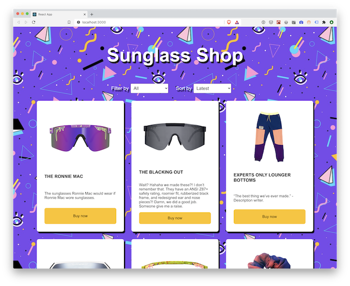

# 01 Exercise - Sunglass Shop: Using JS Modules

## Brief

The Sunglass eCommerce site is using several React Components, but they are all in the same file. You need to refactor the existing code to make use of JavaScript modules.



## Rationale

Using JavaScript modules to separate React components makes your code easier to navigate, test and reason about.

## Getting Started

1. Open the project in VS Code, and open your terminal
2. Type: `npm install` and then `npm start`. The React Application should open in your browser
3. Open `src/App.js` in VS Code. This is the file that you will start working from

## Instructions Part A - Create a module for the `FilterBy` component

1. It's a common practice to have your React components in a folder named `components`. Create a new folder: `./src/components`.
2. Create a new file inside this folder: `src/components/FilterBy.js`
3. Cut and copy the existing `FilterBy` component from `App.js` into `FilterBy.js`
4. Export the `FilterBy` component from `FilterBy.js`

   ```js
   export default FilterBy;
   ```

5. Now you have created a component, you can import it inside `App.js`. Add the following code to the top of `App.js`

   ```js
   import FilterBy from "./components/FilterBy";
   ```

**Acceptance criteria**

- The _Filter by_ component is displayed on the webpage
- The `FilterBy` component is inside its own JavaScript module

## Instructions Part B - Create a module for the rest of the React Components

Repeat the process for the rest of the React Components.

**Note:** When building the `Products` component, it will need to import the `Product` component, instead of in `App.js`

**Acceptance criteria**

- JavaScript modules exist for the following React Components:
  - `FilterBy`
  - `SortBy`
  - `Products`
  - `Product`

---

# Submit your Exercise

- [ ] Commits are pushed to GitHub
- [ ] Automated tests pass in GitHub

---

## Exercise answer walkthrough

- [Sunglass Shop: Using JS Modules exercise walkthrough](https://www.loom.com/share/6bf4c6cd188d4e7abb0a8d34189d9efb)
